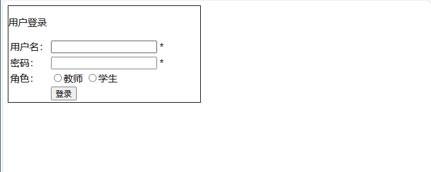
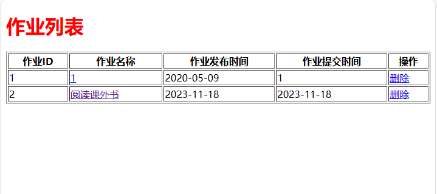

<h1 align="center">教师学生作业设计</h1>

- 完整代码获取地址：从戎源码网 ([https://armycodes.com/](https://armycodes.com/))
- 作者微信：19941326836  QQ：952045282 
- 承接计算机毕业设计、Java毕业设计、Python毕业设计、深度学习、机器学习
- 选题+开题报告+任务书+程序定制+安装调试+论文+答辩ppt 一条龙服务
- 所有选题地址（https://github.com/YuLin-Coder/AllProjectCatalog）
## 项目介绍

教师学生作业设计，前端 Jsp，后端 Servlet，一个方便老师在线布置作业，学生通过电脑浏览器直接查看作业内容，还可以查询历史作业记录，避免作业遗漏的情况；主要功能如下：

### 教师：

- 教师选项登录、按钮列表界面
- 布置作业：包括作业名称、作业内容、提交时间字段，提交完成后即可完成作业布置
- 查看作业：教师布置作业后可以查看已经布置的作业记录、点击作业名称查看作业详情、布置有误的作业可以删除重新布置、历史作业记录也可以进行删除操作

### 学生：

- 学生选项登录、当前作业人数
- 查看作业：查看已经布置的作业记录、点击作业名称查看作业详情

## 环境

- <b>IntelliJ IDEA 2009.3</b>

- <b>Mysql 5.7.26</b>

- <b>Tomcat 7.0.73</b>

- <b>JDK 1.8</b>

## 运行截图

